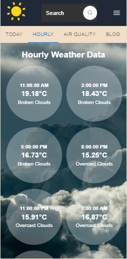
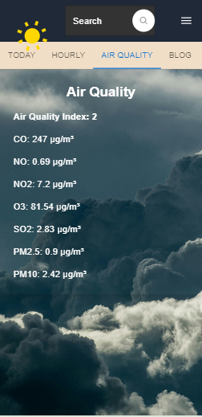
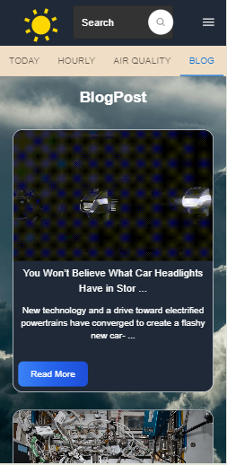
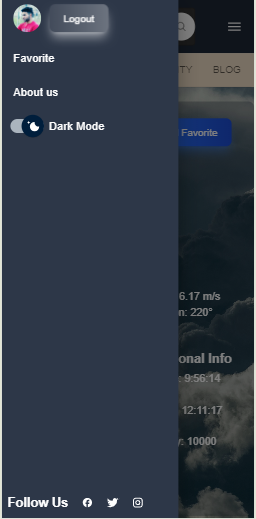
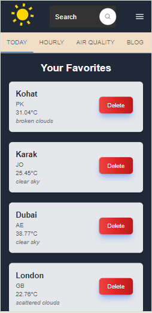
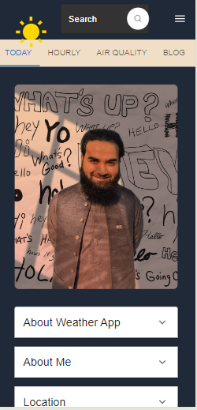

# Weather App

Welcome to the Weather App! This application provides real-time weather information, including today's weather, hourly forecasts, air quality data, and more. Users can also manage their favorite locations, read blog posts, and log in using Google or GitHub accounts through Firebase Authentication.

## Features

- **Today's Weather:** View the current weather conditions for any city.
- **Hourly Forecast:** Get detailed weather information for each hour of the day.
- **Air Quality:** Check the air quality index for your selected location.
- **Favorites:** Add your preferred locations to the favorites list for quick access.
- **Blog:** Read blog posts related to weather and environmental topics.
- **Authentication:** Log in with Google or GitHub using Firebase Authentication.
- **Responsive Design:** The app is fully responsive and works seamlessly on all devices.
- **Dark Mode:** Toggle between light and dark mode for a comfortable viewing experience.

## Technologies Used

### Frontend
- **React.js**: A JavaScript library for building user interfaces.
- **Material-UI (MUI)**: A React component library that implements Google's Material Design.
- **Tailwind CSS**: A utility-first CSS framework for rapid UI development.

### Backend
- **Node.js**: A JavaScript runtime built on Chrome's V8 engine.
- **Express.js**: A minimal and flexible Node.js web application framework.
- **Firebase**: Used for authentication and real-time database.

## Screenshots

Here are some screenshots of the application:

  
  
  

  
  
  

  

## Usage

- **Weather Data**: Search for a city to get the current weather, hourly forecast, and air quality data.
- **Favorites**: Click the star icon to add a location to your favorites. Access your favorite locations from the Favorites page.
- **Blog**: Navigate to the Blog section to read articles related to weather.
- **Authentication**: Log in using Google or GitHub to access personalized features.

## Pages

- **Home**: Displays today's weather data and hourly forecast.
- **Air Quality**: Shows the air quality index for the selected city.
- **Favorites**: Lists the user's favorite locations.
- **Blog**: Contains articles and posts related to weather.
- **Login**: Allows users to log in using Google or GitHub.

## Future Enhancements

- **Weekly Forecast**: Add a feature to show a 7-day weather forecast.
- **User Profiles**: Enable users to update their profiles and manage their account settings.
- **Weather Alerts**: Notify users of severe weather conditions.

## Contributing

Contributions are welcome! Please feel free to submit a Pull Request or open an issue.

## License

This project is licensed under the MIT License.
